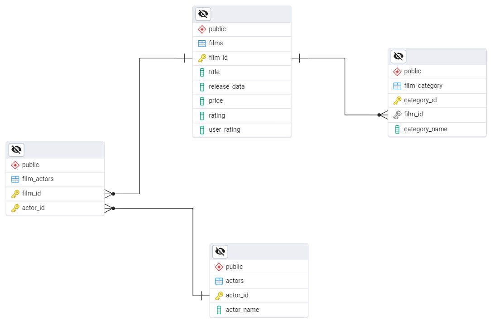
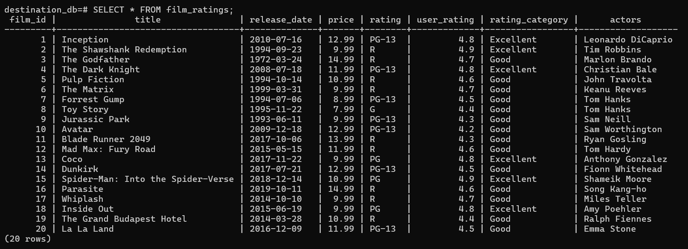

This project is an ELT (Extract, Load, Transform) pipeline that extracts data from a source Postgres database, loads the data to a different Postgres database, and then performs transformations on the data. The data model is represented by the following ER diagram:



The only tranformation is to create a new `film_ratings` table with the movie information and assign each one a rating category (**Excellent**, **Good**, **Average**, **Bad**, and **Trash**) in a new column called `rating_category` based on its `user_rating` column.

## How to run the project
1. It is recommended to create a virtual environment for the project. In the root directory enter the following command:

```bash
python -m venv <virtual environment name>
```

2. Activate the virtual environment.

3. Install the required dependencies:

```bash
pip install -r requirements.txt
```

4. Create a `.env` file in the root directory with the following environment varaibles:

```
DBT_TRANSFORMATIONS_FOLDER_PATH=
DBT_USER_FOLDER_PATH=
```

The `DBT_TRANSFORMATIONS_FOLDER_PATH` is the absolute path of the dbt transformations folder, `dbt_transformations`, in the project directory.

The `DBT_USER_FOLDER_PATH` is the absolute path of the `.dbt` file in the user folder of the operating system.

These are needed by the dbt container volumes as the source.

5. Run Docker Compose to create the container of the `init_airflow` first:

```bash
docker compose up init_airflow -d
```

6. Run the rest of the containers:

```bash
docker compose up
```

7. After all the containers are running, check the `destination_postgres` container to see the internal database:

```bash
docker exec -it <container name of the destination postgres> psql -U postgres
```

Once inside the container bash and with the `psql` prompt, enter:

```bash
\l
```

```bash
\c destination_db
```

```bash
\dt
```

You can see there are not any tables in the database.

8. Go to the Airflow webserver GUI (`localhost:8080`) and trigger the DAG corresponding to the elt process called `elt_and_dbt`.

9. Check the `destination_postgres` container to see if the transformations were applied:

```bash
docker exec -it <container name of the destination postgres> psql -U postgres
```

There should be new tables and one of them should be called `film_ratings` and it should look like this:


